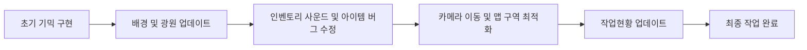

# DevNull_2팀 게임 사이드 프로젝트 🎮

동계시즌 DevNull 2팀의 게임 개발 사이드 프로젝트입니다. 
Unity 엔진을 활용하여 진행 중이며, 다양한 기믹과 최적화된 시스템을 구축하고 있습니다.

---

## 📸 주요 에셋 (Key Assets)

게임 내에서 사용되는 주요 캐릭터, 아이템 및 배경 오브젝트입니다.

### **캐릭터 (Character)**

| 캐릭터 시트 (상태) | 캐릭터 시트 (이동) |
| :---: | :---: |
|  |  |

### **수집 아이템 (Collectibles)**

| Shield (방패) | Star (별) | Lock (자물쇠) | Unlock (해제) | Key (열쇠) |
| :---: | :---: | :---: | :---: | :---: |
|  |  |  |  |  |
| 보호형 아이템 | 수집용 별 | 잠겨있는 상태 | 해제된 상태 | 열쇠 아이템 |

### **장애물 (Obstacles)**

| Laser (레이저) | Cloud (구름 1) | Cloud (구름 2) | Rock (운석) |
| :---: | :---: | :---: | :---: |
|  |  |  |  |
| 턴제 회전 레이저 | 시야 방해 구름 1 | 시야 방해 구름 2 | 물리 충돌 운석 |

### **배경 (Backgrounds)**

#### **일반 배경 (Standard Backgrounds)**
| Background 1 | Background 2 | Home Background |
| :---: | :---: | :---: |
|  |  |  |

#### **AI 생성 배경 (Stable Diffusion)**
| AI Background 1 | AI Background 2 | AI Background 3 |
| :---: | :---: | :---: |
|  |  |  |

---

## 🚀 개발 진행 상황 (Development History)

주요 개발 마일스톤 히스토리입니다.

- **1. 간단한 맵 틀 구현**: 기본적인 맵의 구조와 타일맵 배치
- **2. 카메라 설정 구현 + 맵 이동**: 스테이지 기반 카메라 시스템 및 이동 로직
- **3. 배경 이동 + 빛 추가 + UI / 아이템 추가**: 조명 강화 및 기본 UI/아이템 배치
- **4. count 구현 및 메모리 최적화**: 게임 카운트 시스템 로직화 및 메모리 최적화
- **5. 이야기 서사 UI 및 업데이트**: 대화창 및 서사적 UI 요소 추가
- **6. 기믹 구현 (Key/Lock) 및 사운드**: 잠금 시스템 및 오디오 시스템 통합
- **7. 내비게이션 및 파티클 시스템**: 목표 안내 시스템 및 파티클 피드백 추가
- **8. ItemCollector 리메이크 & 인벤토리 구조화**: Strategy 패턴 도입 및 인벤토리 시스템 고도화
- **9. 이펙트 효과 및 연출 강화**: 몰입감을 위한 전반적인 이펙트 연출 강화
- **10. 캐릭터 동작 및 상태 최적화**: 플레이어 캐릭터 움직임 및 상태 관리 정교화

---

## 🔄 버전 관리 (Git Push History)

최근 깃허브에 PUSH된 순서도와 작업 흐름입니다.

---

## 🛠 주요 기술 및 최적화 (Key Tech & Optimization)

- **오디오 시스템 최적화**: BGMManager의 `Update` 호출을 코루틴으로 대체하여 CPU 부하 경감 및 레이저 사운드 중첩 방지 시스템 구축
- **UI 성능 개선**: UIRoot의 투명도 체크 로직에 쓰로틀링(Throttling)을 적용하여 불필요한 연산 제거
- **렌더링 최적화**: SpriteRotator에 가시성 컬링(Visibility Culling)을 도입하여 화면 밖 연산 최소화
- **이벤트 기반 설계**: GameManager와 각 오브젝트 간의 느슨한 결합을 위해 C# Action 이벤트 활용

---

## 👥 팀원 (Team Members)

- **연수씨**: 개발
- **종욱씨**: 개발
- **준호씨**: 기획
- **정수씨**: 개발 / 기획
