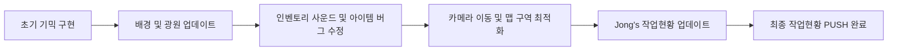

# DevNull_2팀 게임 사이드 프로젝트 🎮

동계시즌 DevNull 2팀의 게임 개발 사이드 프로젝트입니다. 
Unity 엔진을 활용하여 진행 중이며, 다양한 기믹과 최적화된 시스템을 구축하고 있습니다.

---

## 🎬 최종 결과물 (Final Result)

프로젝트의 최종 완성 단계와 주요 기능을 시연한 영상입니다.

---

## � 주요 에셋 (Key Assets)

게임 내에서 사용되는 주요 수집 아이템 및 오브젝트입니다.

| Shield (방패) | Star (별) | Key (열쇠) | Battery (배터리) |
| :---: | :---: | :---: | :---: |
|  |  |  |  |

---

## �🚀 개발 진행 상황 (Development History)

`Jong's 작업현황` 폴더에 기록된 주요 마일스톤 비디오 리스트입니다. (오래된 순)

| 순서 | 작업 내용 | 영상 링크 |
| :--- | :--- | :--- |
| 1 | **간단한 맵 틀 구현** | [영상 보기](file:///c:/Users/하종욱/Documents/GameProject-2/Jong's 작업현황/간단한 맵 틀 구현.mp4) |
| 2 | **카메라 설정 구현 + 맵 이동** | [영상 보기](file:///c:/Users/하종욱/Documents/GameProject-2/Jong's 작업현황/카메라 설정 구현 + 맵 이동.mp4) |
| 3 | **배경 이동 + 빛 추가 + UI / 아이템 추가** | [영상 보기](file:///c:/Users/하종욱/Documents/GameProject-2/Jong's 작업현황/배경 이동 + 빛 추가 + UI 및 아이템 추가.mp4) |
| 4 | **count 구현 및 메모리 최적화** | [영상 보기](file:///c:/Users/하종욱/Documents/GameProject-2/Jong's 작업현황/count 구현 및 메모리 최소화.mp4) |
| 5 | **이야기 서사 UI 및 업데이트** | [영상 보기](file:///c:/Users/하종욱/Documents/GameProject-2/Jong's 작업현황/이야기 서사 UI 추가 + UI 업데이트.mp4) |
| 6 | **기믹 구현 (Key/Lock) 및 사운드** | [영상 보기](file:///c:/Users/하종욱/Documents/GameProject-2/Jong's 작업현황/애니메이션 + key 및 lock + 사운드 및 BGM + 빛 범위 추가.mp4) |
| 7 | **내비게이션 및 파티클 시스템** | [영상 보기](file:///c:/Users/하종욱/Documents/GameProject-2/Jong's 작업현황/내비게이션 + 파티클 시스템 추가 (+ 스크립트 구조 개선).mp4) |
| 8 | **ItemCollector 리메이크 & 인벤토리 구조화** | [영상 보기](file:///c:/Users/하종욱/Documents/GameProject-2/Jong's 작업현황/아이템 수집 구현 + ItemCollector.cs 리메이크 + InventoryManager 스크립트 구조화.mp4) |
| 9 | **이펙트 효과 및 연출 강화** | [영상 보기](file:///c:/Users/하종욱/Documents/GameProject-2/Jong's 작업현황/이펙트 효과 강화.mp4) |
| 10 | **캐릭터 동작 및 상태 최적화** | [영상 보기](file:///c:/Users/하종욱/Documents/GameProject-2/Jong's 작업현황/캐릭터.mp4) |

---

## 🔄 버전 관리 (Git Push History)

최근 깃허브에 PUSH된 순서도와 작업 흐름입니다.

**최근 주요 커밋 로그:**
- `f5b65bc` Jong's 최종작업현황 (Final PUSH)
- `2a12f78` Jong's 작업현황 (Videos Update)
- `8cde6b2` 추가작업 (Script Refactoring)
- `72a4936` Jong's 작업현황
- `4bc0182` 배경 이미지 추가 & UI 개선

---

## 🛠 주요 기술 및 최적화 (Key Tech & Optimization)

- **오디오 시스템 최적화**: BGMManager의 `Update` 호출을 코루틴으로 대체하여 CPU 부하 경감 및 레이저 사운드 중첩 방지 시스템 구축
- **UI 성능 개선**: UIRoot의 투명도 체크 로직에 쓰로틀링(Throttling)을 적용하여 불필요한 연산 제거
- **렌더링 최적화**: SpriteRotator에 가시성 컬링(Visibility Culling)을 도입하여 화면 밖 연산 최소화
- **이벤트 기반 설계**: GameManager와 각 오브젝트 간의 느슨한 결합을 위해 C# Action 이벤트 활용

---

## 👥 팀원 (Team Members)

- **연수씨**: 개발
- **종욱씨**: 개발
- **준호씨**: 기획
- **정수씨**: 개발 / 기획
