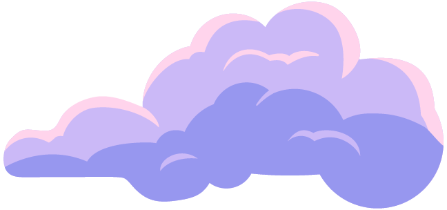
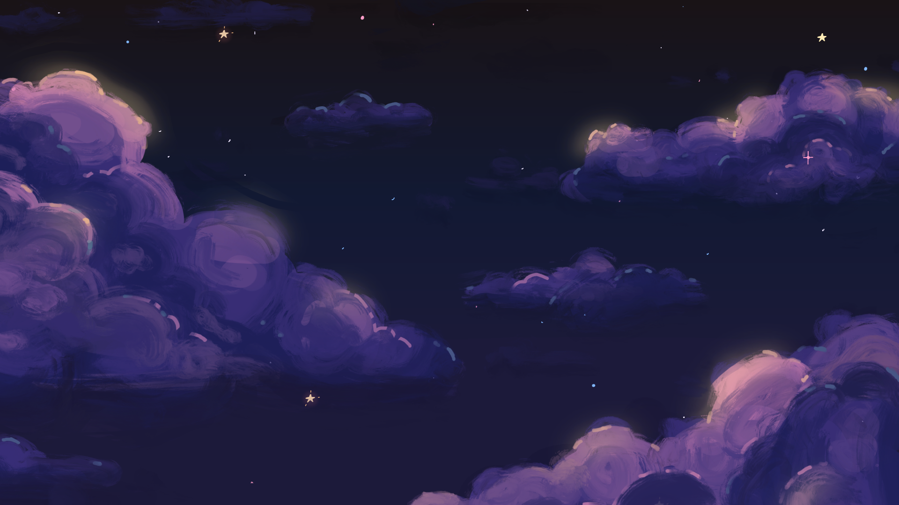
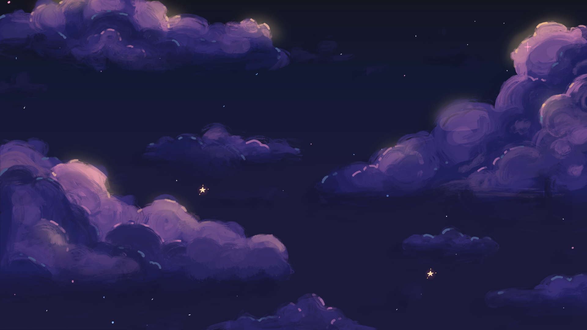
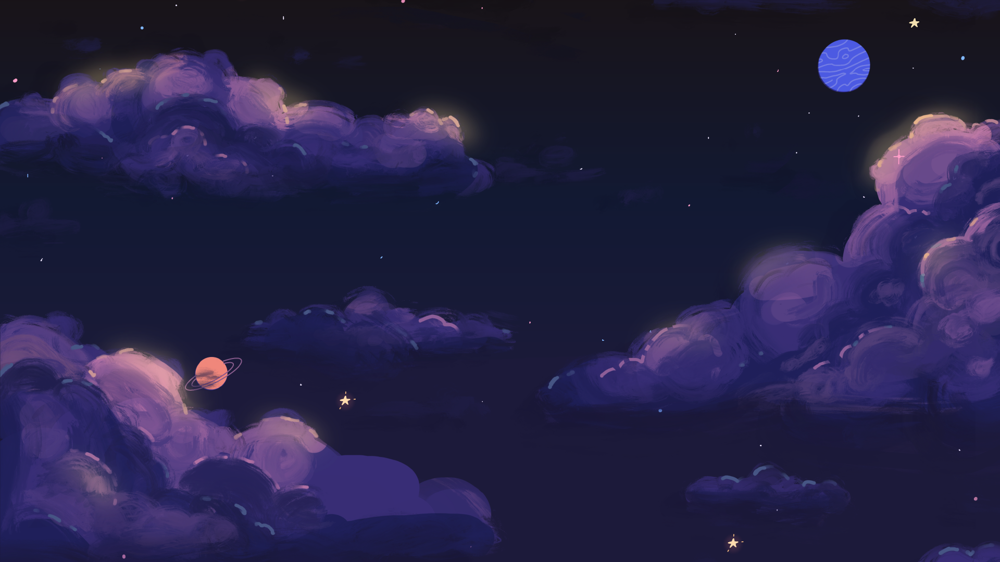
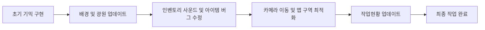

# DevNull_2팀 게임 사이드 프로젝트 🎮

동계시즌 DevNull 2팀의 게임 개발 사이드 프로젝트입니다. 
Unity 엔진을 활용하여 2D 퍼즐 어드벤쳐 게임으로 만들었으며, 다양한 기믹과 최적화된 시스템을 구축했습니다.

---

## 게임 개요

### 🌟 스토리

#### 프롤로그: 어둠 속의 깨어남

눈을 떠보니 검은 바탕에 자그마한 하얀 반점들이 넓게 퍼져 있다. 하얀 반점들은 서로가 자신의 위치를 아는 듯이 그 자리에 고요히 앉아 있는 듯하였다. 

이후 내 손을 보니 나는 놀랄 수밖에 없었다. 나는 까무잡잡하다 못해 칠흑같이 어두운 손이 보였기 때문이다. 그리고 더 나를 옭아매는 것은 **내가 누구인지 모르는 것**이다. 

무섭다. 그리고 답답하다. 벗어나고 싶다. 암흑이 곧 공간인 여기에서 나는 무엇을 해야 할까? 나는 무엇을 찾아야 할까? 

그렇게 나의 감정에 지배 당하였을 때, **하나의 아름다운 빛이 어둠을 사선으로 가로질러 나아가고 있었다.** 그 빛 안에는 노란 머리, 밝은 코트, 무엇보다도 그를 감싸는 빛보다도 더욱 아름다운 미소를 가진 **어린아이**가 있었다. 

어느새 나는 벌떡 일어나 있었다. 왜일까? 나는 저 아이에게 나를 물어보고 싶다. 설령 못 물어본다고 할지라도 그에게 도달하고 싶다. 서두르자. 내가 지체할수록 그는 더욱더 멀리 떠날 터이니.

---

#### Chapter 1: 왕이 사는 별 - 역할의 의미

이윽고 한 별에 도착하게 된다. 손에는 별과 별을 옮겨 다니면서 행성의 먼지들과 공허감만이 내 손에 감겨 있다. 하지만 내 마음 속엔 한 가지 목표가 강하게 새겨졌다. **그 어린 아이를 만날 것이라고.**

"너는 누구냐" 준엄한 목소리가 나에게 다가왔다. 주변을 돌아보니 **노란 왕관에 다양한 보석이 박혀 있는 남자**가 나에게 말을 걸어왔다. 

"어서 이리로 오너라. 내가 너에게 가장 좋은 것을 하사하겠다"

내 마음이 솔깃해졌다. "그게 뭔데요?" 

이윽고 옅은 미소를 지은 남자는 나에게 말하였다. "너에게 이 행성을 다스릴 수 있는 **총리의 직**을 주마"

실망이다. 나는 역할을 원하는 것이 아니다. 나는 실망한 마음을 감추고 이에 대답했다. "그것이 무엇인지는 모르겠지만 저는 가장 좋은 것을 찾고 있어요."

왕이 말하였다. "그렇다 너는 총리의 직분을 통해서 이 별과 이 우주를 다스릴 수 있다. 그리고 나를 제외한 모든 사람들이 너에게 절할 것이다."

나는 휑량한 주변을 보고 당황했다. 나는 단순히 역할을 얻고 따르기 위해서 떠난 것이 아니다. 나는 어떤 존재인지, 나는 어떻게 살아가야 할지 알아야 한다. 내가 좋은 직분을 얻는다 한들 그것이 얻고자 하는 것이 아니라는 것은 누구보다도 잘 알았다.

"아저씨의 허락은 감사하지만 그것이 제가 찾는 것은 아닌 것 같네요"

왕은 말하였다. "왜 아니라고 생각하는 것이냐? 세상 사람들과 모든 우주가 너에게 절할 것이다"

나는 대답했다. "이 별에서 굳이 얻는다 할지라도 그것이 제 행복은 아닌 것 같아서요, **당신은 행복하신가요?**"

왕은 눈살을 찌푸리다 곰곰히 생각에 빠지는 듯 하였다. 그럴 수 밖에 없듯이 그는 그 자리에 몇 년 동안 있었지만 그의 주변에는 아무도 없었다. 그는 외로웠다. 그리고 사람이 필요하였다. 

화려하지만 외로운 왕관을 가진 남자는 말하였다. "모르겠다. 그리고 가장 느껴지는 감정은 **외로움**이였어"

나는 말하였다. "아저씨도 좋은 것을 찾길 바래요. 저는 이만"

나는 그 남자를 뒤로 한 채로 별을 떠날 채비를 하자 남자는 나에게 손을 뻗었다. "잠깐, 너의 이름이 뭐야?"

나는 대답했다. "저도 몰라요"

남자는 나에게 말하였다. "나는 너를 통해서 내 모습이 가장 위대한 모습이 아니라는 것을 깨달았어. 나의 선글라스를 너가 벗겨주었어. 너를 **'거울'**이라고 불러도 좋을까?"

거울이라, 아무런 이름이 없는 것보다는 나은 것 같았다. "좋아요 그럼 진짜로 떠날게요"

나는 다리를 살짝 굽혔다 힘차게 폈다. 점차 남자와 멀어지는 것이 느꼈졌다. 뒤에 나지막이 남자의 말이 들렸다. **'잘가, 그리고 또 보자 거울아'**

---

#### Chapter 2: 바오밥 나무의 별 - 책임의 무게

또 다시 도착이다. 여긴 어딜까? 차가운 발 끝에서 나는 느껴졌다. 누군가가 살던 행성과 같다. 투박하지만 누군가의 공간이 이곳에서 느껴진다. 누굴까? 

그러나 주변을 돌아보고 이리저리 돌아다녀도 사람은 안 보인다. 분명히 내 눈에는 사람의 손길이 느껴지는 데도 불구하고 말이다.

지친 느낌이 느껴진 나는 자리에 털썩 앉았다. 그 아이는 누굴까? 내가 그 친구를 만나게 되면 뭐 먼저 물어볼까? 이러한 생각들이 내 주변을 서성일 무렵 내 눈에 한 가지가 보였다. 

**새싹**이였다. 칠흑같은 우주 안에서 푸릇푸릇한 새싹이라니 이질감이 체감된다. 눈에 튀인 새싹을 중심으로 뛰엄뛰엄이지만 행성 전체를, 그리고 내 주변에 많은 새싹들이 보이기 시작하였다.

그리고 나와 조금 거리가 떨어진 곳에서 **그림 하나**가 보였다 호기심이 생긴 나는 일어나 그 그림이 그려진 종이를 집었다. 종이 중앙에는 행성이 그려져 있었다. 그리고 행성을 감싸고 있는 **3개의 바오밥 나무**가 12시, 5시, 7시 방향으로 뻗어 있었고, 그 아래에는 **"바오밥 나무 새싹을 제거할 것"** 이라는 문구가 수필로 적혀있었다.

바오밥 나무가 이렇게 커질 수 있다는 점에서 놀랐지만 무엇보다도 이 행성을 뒤덮을 수 있을 정도로 커진다는 것이 신기했다. 그렇다면 이 곳에 자라난 새싹들 중 몇개는 바오밥 나무 새싹이라는 것일까?

바오밥 나무가 이 행성을 뒤덮게 된다면 따뜻한 온기를 가진 이 행성도 아무것도 살 수 없는 공간이 된다. 무엇보다도 이렇게나 크게 자라나게 된다면 제거할 수가 없을 것이다. 그렇기에 누군가가 여기에 새싹을 뽑으라는 그림을 그렸을 것이다.

나는 이 곳을 떠날 것이다. 하지만 이 행성의 주인을 위해서 하나 정도는 뽑아 갈 수 있지 않을까? 나는 주변을 돌아보고 커 보이는 새싹을 하나 제거하였다. 이 새싹이 바오밥 나무 새싹일 것이다. 

나는 그 새싹을 **내 귀 위에 끼웠다.** 이 새싹은 기억이 되어 나의 마음 속에 남을 것이다. 나는 떠날 채비를 하였다. 이제 가보자. 다시 뜀으로써 일어났다. 

내가 있던 행성이 다시끔 먼지처럼 작아보일 때, 그 행성에서는 **유리 관 속에 한 장미**가 떠나는 이를 보고 있었다.

---

#### Chapter 3: 여우의 별 - 경험의 가치

또 다른 행성이다. 이 행성은 이제껏 보았던 행성과는 달랐다. **초록색과 파란색이 뒤섞여 있는** 이 곳은 참으로 아름다운 곳인 것 같다. 

행성의 땅에 도착하자 우주에서 본 모습은 빙산의 일각이였음을 깨달았다. 하늘 위로는 파란색, 땅에는 흙갈색으로 뒤덮여 있음이 하나의 조화로 보이고 그 주변을 채우는 푸릇푸릇, 초록색의 생명체들은 무대와 같은 이 행성에서 주연 배우처럼 빛이 난다. 

그리고 이 공간을 채우는 따뜻한 공기는 어두웠던 내 마음을 다시끔 생동감 있게 만들었다. **참으로 아름답다.**

부스럭부스럭 갑자기 땅에 꽂혀 있는 풀이 움직인다. 그러고는 감춰져 있던 **주황색 동물**이 천천히 내 앞으로 나아왔다.

"뭐야, 노란색 친구가 아니고 다른 친구가 왔네"

심지어 그 동물은 말을 할 수 있었다. "너는 누구야"

나는 물어봤다. "보면 몰라? **여우**지"

삼각형 모양으로 튀어나와있는 입과 오독하고 광나는 코는 그 동물의 외모를 한층 더 띄우는 듯한 느낌을 주었다.

여우가 머슥해 하며 말하였다. "너가 나를 길러줄래?"

나는 여우에게 물어보았다. "길러준다는 것이 뭔데?"

여우는 당황한 듯 보였다. 그럴 수 밖에 없는 것이 길러주기를 거절한 노란 머리 어린 아이는 있어도 길러주기를 모르는 아이는 처음이기 때문이다.

"흠... 너랑 내가 서로 감정을 교감을 지속하는 것?"

나는 생각하였다. 그것이 의미가 있을까? 나는 내가 누군지도 모르는데 이 상태에서 누군가와 교감한다는 것이 쉬울까 싶었다.

나는 말하였다. "미안하지만 나는 내 의미를 찾기 위해서 노란 머리를 찾고 있어"

여우는 고개를 갸우뚱하면서 말하였다. "너는 너 스스로가 뭔지 몰라?"

나는 말하였다 "그래, 나는 갑자기 어떤 별에서 눈이 떠졌어, 그리고 마치 모든 것을 잊어버린 듯해, 내가 누군지도 모르겠고 어떻게 해야 할지도 모르겠어"

나는 다시끔 두려움이 나를 감싸는 느낌이 들었다. 두렵다. 

갑작스러운 여우의 한 마디에 두려움이 멈칫하는 듯한 느낌이 들었다. **"너는 너가 누군지 알아야 해?"**

나는 고개를 들고 여우를 똑바로 보았다. 당연한 질문을 나에게 해서 나는 오히려 어이가 없었다. 나는 약간은 상기된 상태에서 말하였다.

"당연한 것 아니야? 그러면 모르는 것이 낫다는 말이야?"

여우는 고개를 좌우로 저으며 말하였다. "그게 아니야"

여우는 좀 더 나의 눈을 마주치며 말하였다. **"너는 너를 몰라서 두려운 것이 아니라 의미를 몰라서 두려운 거야"**

저게 무슨 소리일까? 내가 고민하는 중에 여우가 이어서 말하였다. "그리고 그 의미는 너가 채워가면 돼"

나는 여우에게 물어보았다. "그 의미 라는 것을 내가 어떻게 채울 수 있을까?"

여우는 미소를 머금은 채 나를 바라보며 말하였다. **"너가 할 일은 없어, 그냥 이 순간순간을 즐기면 돼"**

나는 말하였다. "그게 무슨 뚱딴지 같은 소리야?, 경험이 의미가 된다니?"

여우는 말하였다. "누구나 백지와 같이 이 세상에 태어나서 적응하기 위해서 노력해. 근데 가장 중요한 것은 우리가 **백지 상태**라는 것이야. 백지는 거기에 뭐든 그릴 수 있어, 오히려 무언가가 그려져 있다면 너가 그릴 공간을 줄어들지."

나는 말하였다. "그 백지에 그리는 방법이 경험하는 것이라고?"

여우는 말하였다. "맞아, 그래서 너는 **너가 뭐였는지가 아닌 지금부터 너가 될지가 중요해.**"

나는 말하였다. "하지만 새로운 것을 경험하는 것은 두려운 걸.."

여우는 말하였다. "그렇겠지. 누구나 그래. 그렇기 때문에 힘들기도 하지. 하지만 너가 잠시 숨을 고를 때, 너의 종이에 그려진 그림을 보게 된다면 기쁠 거야. 그리고 그게 쌓이고 쌓이다 보면 **그 두려운 순간마저 즐거울 때가 올테지**"

나는 고개를 잠시 숙였다. 맞다. 왕이 살고 있는 행성, 바오밥 나무 새싹이 자라나는 행성, 그리고 지금의 여우가 살고 있는 행성, 이 경험들이 모여 하나의 기억이 되고 추억이 되었다. 이 끝에는 내가 누군지 알기보다 **내가 누가 될지가 더욱 중요할 때**가 올 것이다.

고민 중에 여우가 말하였다. "아까 노란 머리를 찾는다고 하였지? 그 아이는 저 행성으로 갔어."

여우는 한 행성을 바라보며 말하였다. 점으로 보일 정도로 멀었지만 적어도 경험을 기대하는 나에게는 가까워 보였다.

나는 말하였다. "고마워, 이제는 내가 누구였는지 보다 **누가 될지를 찾아볼게** 그리고 내가 누군가 되었을 때, 너를 다시 보러 올게"

여우는 웃으며 말하였다. "그래, 그 모습 나도 기대 된다."

나는 다시끔 뛸 자세를 준비하고 뛰었다. 다시 암흑과 같은 공간에 돌아왔다. 하지만 이번에는 다르다. 처음 그 노란 머리 아이를 봤을 때, 그를 감싼 밝은 빛처럼 **지금의 나의 주변에는 희망이 가득 차 있었다.**

---

#### Chapter 4: 어린 왕자의 별 - 의미를 만드는 자

별에 도착하였다. 뭔가 이상하다. 공기와 분위기, 모두가 익숙한 곳이다. 마치 한번은 꼭 들렸던 곳이다. 내가 착각하여 잘못 온것 일까? 아니다. 여우는 분명히 이 행성을 가리켰다. 

하지만 여기는 내가 바오밥 나무 새싹을 뽑았던 그 곳이다. 나는 손을 들어 귀에 있는 새싹을 만졌다. 똑같다. 지면을 덮고 있는 작은 새싹들은 내가 귀에 끼워둔 새싹의 모양과 같다.

내가 감탄하는 사이 누군가의 목소리가 들려왔다. "또 왔네"

나는 깜짝 놀라 주변을 돌아봤다. 분명 목소리가 들렸지만 아무도 없었다. 

다시 목소리가 들리기 시작하였다. "바보야, 아래를 봐"

나는 고개를 아래로 내렸다. 그곳에는 **작은 유리돔이 땅에 박혀있었고 그 안에 있는 작은 장미**가 있었다.

장미는 고개를 돌려서 누군가에게 부르듯이 말하였다. "야, 내가 말했었던 그 사람이 왔어, 빨리 와봐"

나는 그 장미가 바라보는 공간으로 고개를 돌렸다. 거기에는 내가 이토록 찾았던 **노란 머리의 아이**가 있었다.

"엇, 찾았다"

가슴 속이 벅차 올라 나도 모르게 말을 뱉어버렸던 것이다. 다행히도 노란 머리 아이와 장미꽃은 내 목소리를 못 들은 듯 보였다.

천천히 걸어오던 노란 아이는 나를 보며 말하였다. "너는 누구야?"

나는 흥분한 감정을 숨기고 말하였다. "너에 대해서 궁금해서 따라왔어"

노란 머리 아이는 갸우뚱하다가 곧바로 부드러운 미소를 가지고 나를 바라보며 말하였다. "나를 궁금해 한다고?"

장미는 내 말이 독특하다듯이 끼어들었다. "하하, 너를 궁금해 하다니 신기한데?"

어린 왕자는 살짝 고개를 찡끄렸다. 나는 내 벅차오르는 감정을 참을 수가 없었다. 이 감정이 이렇게 말함으로써 해소하길 원하면서 노란 머리 아이에 말하였다.

"사실 어느 행성인지도 모르는 곳에 나는 태어났어, 그러는 중에 날아가는 너를 보았고 너에게 답을 얻을 수 있을까 하여 너를 찾아왔어"

어린 왕자는 잠잠히 내 목소리를 들어주었다. 그러고는 나에게 물어보았다. "근데 나를 찾기위해서 힘들지 않았어?, 여기 주변에는 행성이 너무 많은데,"

나는 고개를 끄덕거리며 말하였다. "진짜 힘들었지, 오면서 왕도 만나고, 바오밥나무 새싹도 줍고, 여우도 만났어, 여우가 있던 곳은 참으로 아름답더라."

어린 왕자는 입을 가리고 작게 웃으며 말하였다. "바오밥 나무 새싹? 아, 너가 귀에 걸고 있는거?"

나는 뭔가 부끄러운 감정이 들어 귀에 걸려 있는 바오밥나무 새싹을 손으로 가렸다. 이어서 장미가 말하였다. "내가 말했잖아, 바오밥나무 새싹 줍고 간 애가 있었다고"

어린 왕자는 나에게 말하였다. **"그래서 어땠어?"**

나는 "응?" 하며 고개를 갸우뚱하였다. 그러고는 말하였다. "그게 무슨 소리야? 어땠냐니?"

노란 머리 아이는 말하였다. "너가 지나온 시간들이 너한테는 어떤 의미를 주었어?"

나는 생각해보았다. 갑작스러운 존재에서 나는 지금까지 거쳐온 순간을 기억해보았다. 왕과 바오밥 나무 새싹 그리고 여우까지 이것들은 나의 경험이 되었고 기억이 되었다. 하지만 이러한 것들이 나에게는 무슨 의미가 되었다는 것일까?

노란 머리 아이는 나에게 다시 말하였다. "딱히 의미라는 것이 당연히 떠오르지 않을 거야. 의미라고 말할 수 있는 것은 한 문장으로 정의할 수가 있어야 하는데 너가 겪은 것은 그냥 경험이잖아, 그렇지?"

나는 고개를 끄덕거렸다. 맞는 말이다, 나는 지금까지도 경험한 것에서 의미를 찾을 수 없었다. 하지만 이런 것들이 무슨 상관인거지?

노란 머리 아이는 나에게 말하였다. "나도 마찬가지야, 나도 너처럼 일방적으로 경험하는 존재인 걸, 하지만 다른 점이 있다면 **경험을 당하는 것을 넘어서 경험하고자 한다는 것**이지"

나는 말했다. "경험을 하고자 한다고?"

어린 아이는 고개를 끄덕이며 말하였다. "그래, 경험을 당하는 것과 하고자 하는 것은 매우 달라, 모든 일의 **주체**가 달라지거든. 경험을 당하는 것은 밖에서 너에게로, 경험을 하고자 하는 것은 **너에게서 밖으로 나가는 거야**"

나는 고개를 끄덕거렸다. 하지만 이것이 어떻다는 걸까? "하지만 그것들이 나에게 위로가 되어주지 못하는 걸?"

노란 머리 아이는 말하였다. "그치 의미는 아직도 없을 것이고 내가 말한 것들은 당연한 사실이지, 하지만 **너는 경험을 하고자 할 수 있는 존재**라는 거야. 너가 원하는 그곳에서 원하는 행동을 할 수 있어. 또한 너가 당장은 원해도 얻지 못하는 것들은 얻기 위해서 노력할 수도 있지. 물론 이것들에는 의미가 없어. 하지만 **너는 너만의 의미를 만들고 성취할 수 있어. 그것이 너가 살고 있는 의미라고 생각해**"

나는 띵해졌다. 이것이 나의 의미라고? 하지만 맞는 말이다. 아무런 의미가 없기 때문에 나는 뭐든지 될 수가 있다. 그렇기에 이렇게 노란 머리 아이를 찾기 위해서 열심히 노력하였고 결국에는 이렇게 만나서 이야기 하고 있다. 나는 벌써부터 노란 머리 아이를 만들고 대화한다는 목표를 하나 만들어내고 그걸 이룬 것이였다.

나는 다시 물었다. "그러면 이제는 내가 뭘 해야 할까?"

그 아이는 답하였다. "그건 나도 잘 모르겠지만 여기 앉아볼래? 내 이야기를 들려줄게."

나는 말했다. "너의 이야기 궁금하다 한번 들려줄래?"

노란 머리 아이는 말했다. "맞다 내가 누군지에 대해서 이야기 한 적이 없네, 내 이름은 **어린 왕자**야. 잘 부탁해. 너의 이름은..."

나는 머리를 긁적거렸다. "아 맞다. 너는 잘 모른다 했지? 그러면 **'그림자'** 어때?"

나는 말했다. "왜 그림자야?"

어린 왕자는 말하였다. "음... 그림자는 보기엔 어두워 보이지만 결국에 **빛이 있어야 존재**하거든. 의미를 찾는 너의 모습이 의미라는 빛을 등지고 있어서 그런 것 같아. 하지만 이제는 **고개를 돌리면 좋을 것 같아.**"

그림자.. 나의 모습을 설명해주는 듯하였다. 

"좋아, 이제 너의 이야기를 시작해보자."

장미는 크게 말하였다. "나도 껴줘"

어린 왕자와 그림자는 웃음을 짓었다. 어린 왕자와 그림자는 자리에 앉아서 **오래도록 끝나지 않을 듯한 이야기를 시작하였다.**

---

### 🎮 게임 시스템

#### 핵심 메커니즘
- **2D 그리드 기반 이동**: 타일 단위로 정확하게 움직이는 턴제 이동 시스템
- **퍼즐 해결**: 각 별마다 고유한 퍼즐과 도전 과제
- **아이템 수집**: 별을 여행하며 특별한 아이템들을 모으고 사용
- **캐릭터 성장**: 경험을 통해 새로운 능력을 획득

#### 주요 기능
- 별과 별 사이를 이동하는 우주 여행
- 각 별마다 독특한 환경과 캐릭터
- 스토리 기반의 퀘스트 시스템
- 아름다운 비주얼과 음악

### 🎯 개발 목표

- 감성적이고 철학적인 스토리텔링
- 직관적이고 부드러운 게임플레이
- 아름다운 비주얼과 음악으로 몰입도 향상
- 플레이어가 각자의 의미를 찾아가는 여정

---

## 기술 스택

- **Engine**: Unity 2D
- **Language**: C#
- **Version Control**: Git

## 📸 주요 에셋 (Key Assets)

게임 내에서 사용되는 주요 캐릭터, 아이템 및 배경 오브젝트입니다.

### **캐릭터 (Character)**

| 캐릭터 시트 (상태) | 캐릭터 시트 (이동) |
| :---: | :---: |
|  |  |

### **수집 아이템 (Collectibles)**

| Shield (방패) | Star (별) | Lock (자물쇠) | Unlock (해제) | Key (열쇠) |
| :---: | :---: | :---: | :---: | :---: |
|  |  |  |  |  |
| 보호형 아이템 | 수집용 별 | 잠겨있는 상태 | 해제된 상태 | 열쇠 아이템 |

### **장애물 (Obstacles)**

| Laser (레이저) | Cloud (구름 1) | Cloud (구름 2) | Rock (운석) |
| :---: | :---: | :---: | :---: |
|  |  |  |  |
| 턴제 회전 레이저 | 시야 방해 구름 1 | 시야 방해 구름 2 | 물리 충돌 운석 |

### **배경 (Backgrounds)**

#### **일반 배경 (Standard Backgrounds)**
| Background 1 | Background 2 | Home Background |
| :---: | :---: | :---: |
|  |  |  |

#### **AI 생성 배경 (Stable Diffusion)**
| AI Background 1 | AI Background 2 | AI Background 3 |
| :---: | :---: | :---: |
|  |  |  |

---

## 🚀 개발 진행 상황 (Development History)

주요 개발 마일스톤 히스토리입니다.

- **1. 간단한 맵 틀 구현**: 기본적인 맵의 구조와 타일맵 배치
- **2. 카메라 설정 구현 + 맵 이동**: 스테이지 기반 카메라 시스템 및 이동 로직
- **3. 배경 이동 + 빛 추가 + UI / 아이템 추가**: 조명 강화 및 기본 UI/아이템 배치
- **4. count 구현 및 메모리 최적화**: 게임 카운트 시스템 로직화 및 메모리 최적화
- **5. 이야기 서사 UI 및 업데이트**: 대화창 및 서사적 UI 요소 추가
- **6. 기믹 구현 (Key/Lock) 및 사운드**: 잠금 시스템 및 오디오 시스템 통합
- **7. 내비게이션 및 파티클 시스템**: 목표 안내 시스템 및 파티클 피드백 추가
- **8. ItemCollector 리메이크 & 인벤토리 구조화**: Strategy 패턴 도입 및 인벤토리 시스템 고도화
- **9. 이펙트 효과 및 연출 강화**: 몰입감을 위한 전반적인 이펙트 연출 강화
- **10. 캐릭터 동작 및 상태 최적화**: 플레이어 캐릭터 움직임 및 상태 관리 정교화

※ 자세한 내용은 'Jong's 작업현황' 폴더를 참고해주세요.

---

## 🔄 버전 관리 (Git Push History)

최근 깃허브에 PUSH된 순서도와 작업 흐름입니다.

---

## 🛠 주요 기술 및 최적화 (Key Tech & Optimization)

- **오디오 시스템 최적화**: BGMManager의 `Update` 호출을 코루틴으로 대체하여 CPU 부하 경감 및 레이저 사운드 중첩 방지 시스템 구축
- **UI 성능 개선**: UIRoot의 투명도 체크 로직에 쓰로틀링(Throttling)을 적용하여 불필요한 연산 제거
- **렌더링 최적화**: SpriteRotator에 가시성 컬링(Visibility Culling)을 도입하여 화면 밖 연산 최소화
- **이벤트 기반 설계**: GameManager와 각 오브젝트 간의 느슨한 결합을 위해 C# Action 이벤트 활용

---

## 📚 참고 자료
- ChatGPT: 주로 구조를 설계하고 역할 및 이벤트 발생하는 로직 구현에 주로 사용함.
- Gemini: ChatGPT로 짠 스크립트를 바탕으로, GC(Garbage Collection)을 줄이는 방향으로 최적화에 도움을 받았으며 그거를 중심으로 사용함.
- Claude: 아키텍쳐 및 API 구조를 세부화해서 설계한 후 구현에 사용함 + 일부 스크립트의 Manager 구조를 디자인 패턴으로 적용시켜 성능을 개선시킴(ex. ItemCollector.cs의 구조를 Strategy + Factory Method 패턴으로 사용하여 세부 내용을 API로 분리한 후 코더가 구현하기 쉽게 만듦).
- Codex: 폴더 구조를 파악 및 전체적인 구조의 흐름을 정리하는데 주로 사용함. 또한, 깃허브와 연결되어 있어 깃허브의 커밋 히스토리를 파악하는데 도움을 받음.
- Antigravity: Planning 기능으로 명령 프롬포트의 구조를 세부화해서 설계한 후 구현에 사용함. 또한, 게임 프로젝트의 전반적인 구조를 파악하는데 도움을 받았으며, 전체 스크립트들의 구조와 참조의 형태를 파악하여 수정하는데 많은 도움을 얻었음. 자세한 내용은 "주요 기술 및 최적화"의 내용과 같음.
- Cursor: Antigravity와 마찬가지로 명령 프롬포트의 구조를 세부화해서 설계함. 단, 차이점은 Cursor 창에서 바로 작업할 수 있다는 점에서 작업 효율이 좋았음. 또한, Antigravity보다 더 직관적으로 코드를 수정할 수 있었음.

## 👥 팀원 (Team Members)

- **최연수**: 개발
- **하종욱**: 개발
- **변정수**: 개발
- **송준호**: 기획

